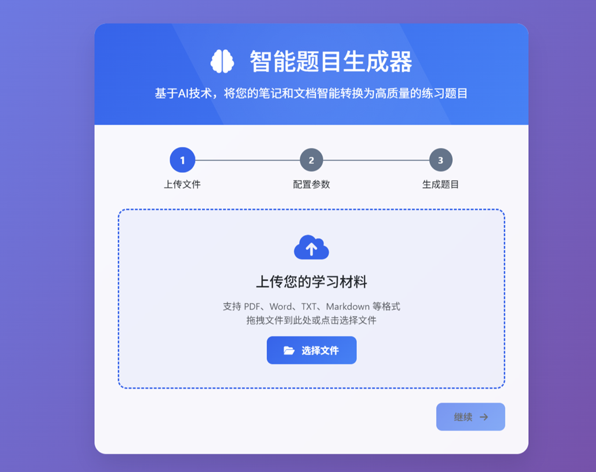
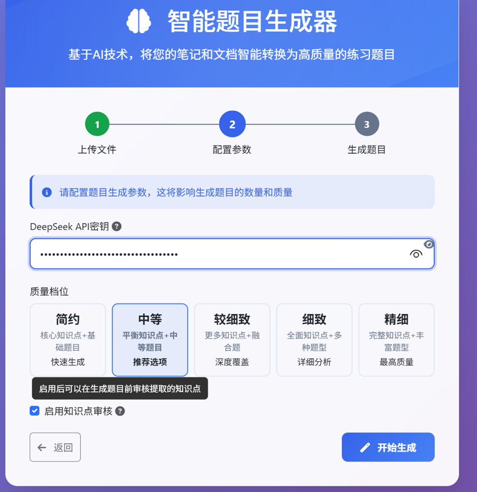
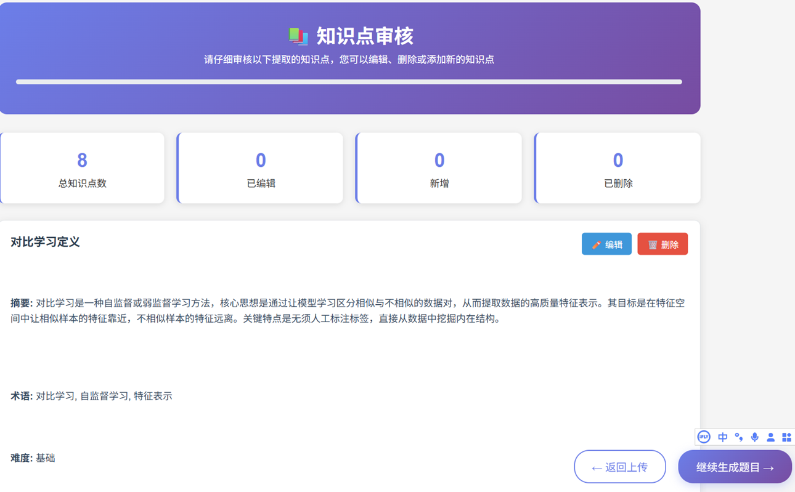
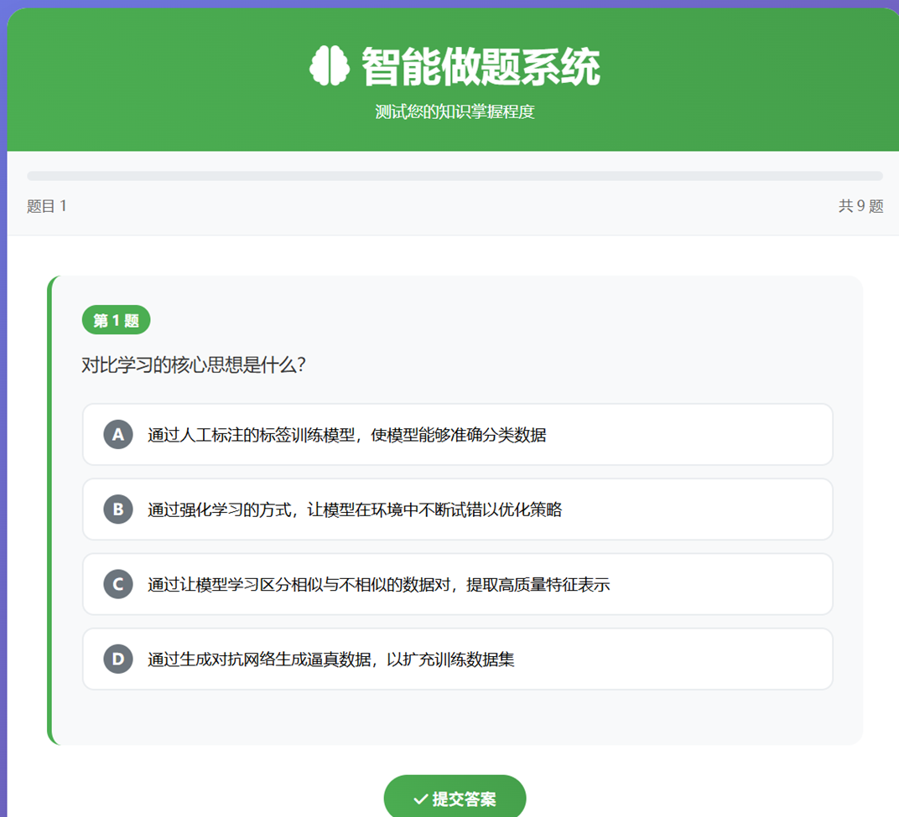
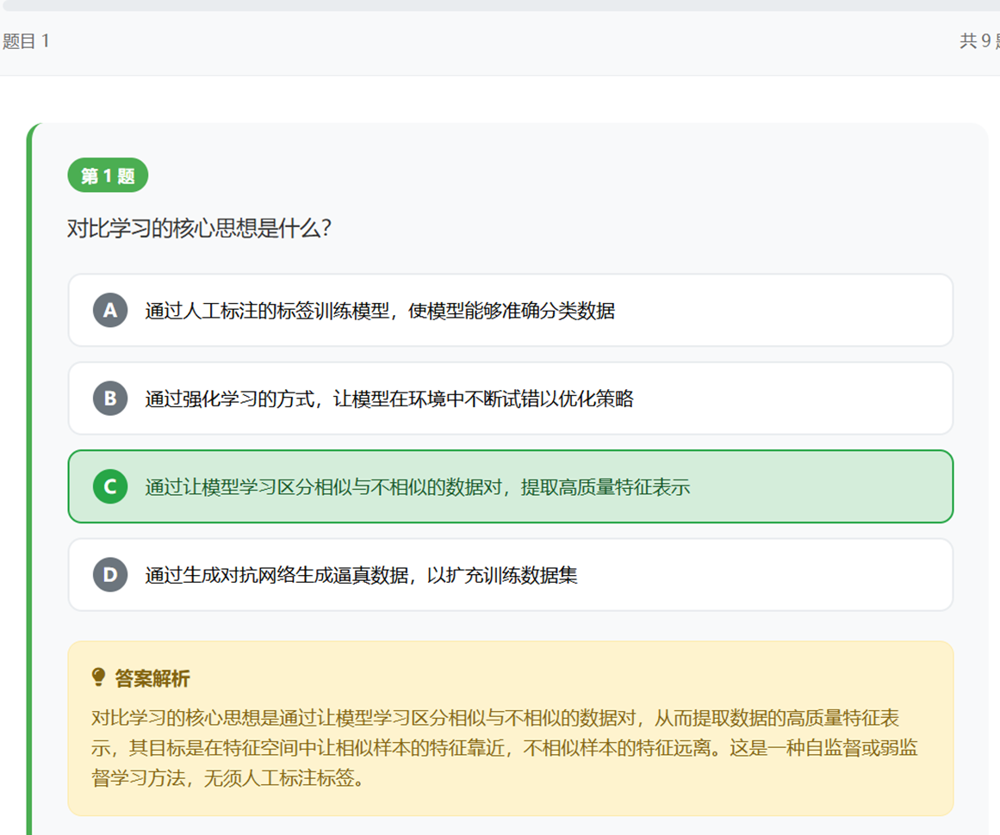
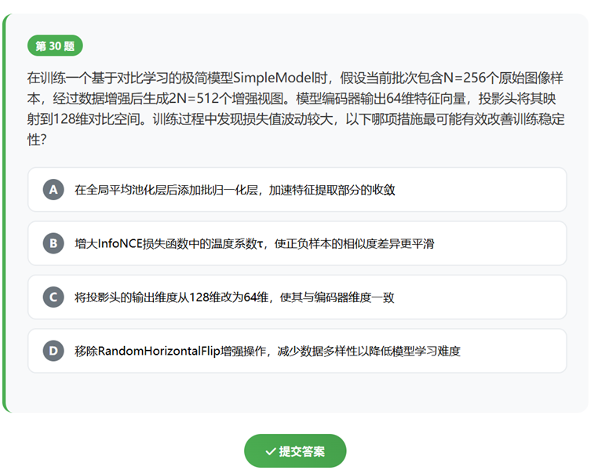
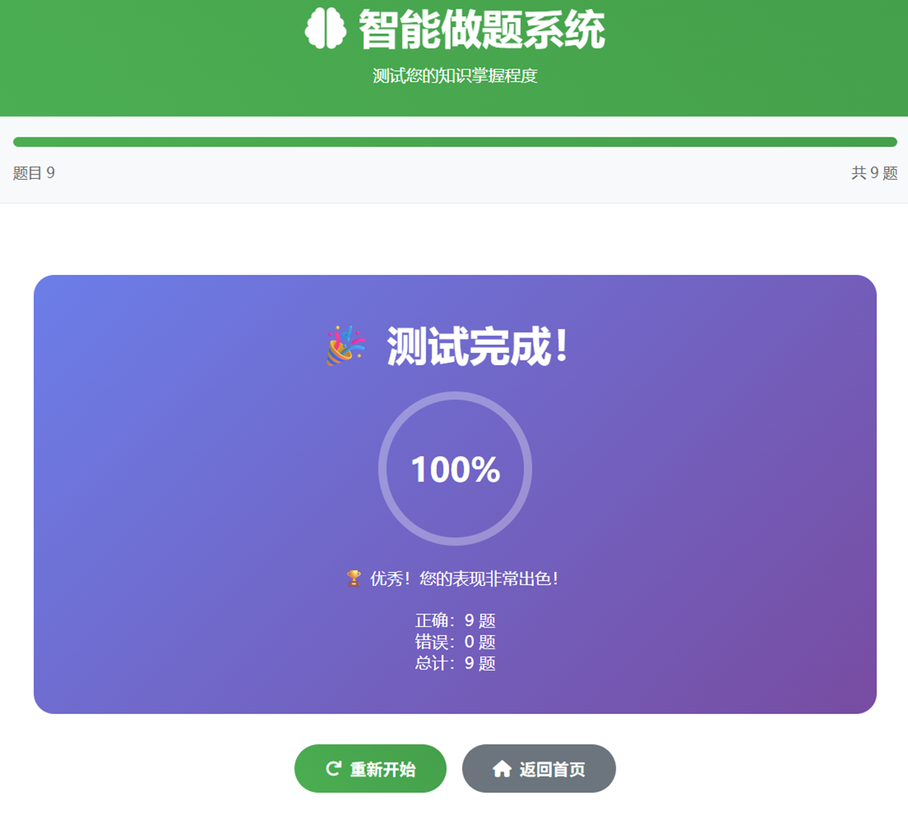

Here is the precise, word-for-word English translation of your entire guide:

# AI-Question-Generator  
This is an intelligent question generator that can personalize questions from your own notes.  

# AI-Question-Generator User Guide  

## Usage Steps  

### 1. Prepare Materials  
- Supported file formats: PDF, Word (.doc, .docx), txt, md, markdown  
- Recommended to use well-structured study notes or textbooks  

### 2. Obtain API Key  
- Visit [DeepSeek Official Website](https://platform.deepseek.com/)  
- Register an account and obtain an API key  
- Securely save your key; it is required for every use  

### 3. Usage Process  
1. **Upload File**: Drag and drop or click to select your learning material  
2. **Configure Parameters**:  
   - Enter DeepSeek API key  
   - Select quality level (recommended "Medium")  
   - Decide whether to enable knowledge point review  
3. **Generate Questions**: Click "Start Generation" and wait for processing to complete  
4. **Test Answers**: Complete generated questions online  
5. **View Results**: Check scores and detailed explanations  
6. **Repeat Testing**: Questions can be retaken multiple times  

## Quality Level Description  
- **Basic**: Quickly generates core questions  
- **Medium**: Balances quality and speed  
- **Detailed**: More knowledge points and question types  
- **Comprehensive**: Fully covers knowledge points  
- **Precise**: Highest quality output  
- As quality levels increase, questions integrate multiple knowledge points and feature greater difficulty. Higher levels generate more questions, suitable for users wanting to consolidate foundations.  

## Effect Demonstration  
  
  
  
  
  
  
  

## Frequently Asked Questions  

### Q: Why is an API key required?  
A: Question generation uses DeepSeek's AI model, requiring your own key to call the service.  

### Q: What to do if file upload fails?  
A: Check if file format and size meet requirements, and ensure stable network connection.  

### Q: Unsatisfied with generated question quality?  
A: Try selecting a higher quality level, or enable knowledge point review to manually adjust.  

## Precautions  
- Do not upload files containing sensitive information  
- API keys are used only for the current session and will not be saved  
- Regularly clear browser cache is recommended  
- Queuing may be required during peak hours  

## Technical Support  
Contact if issues arise: 1808605037@qq.com
